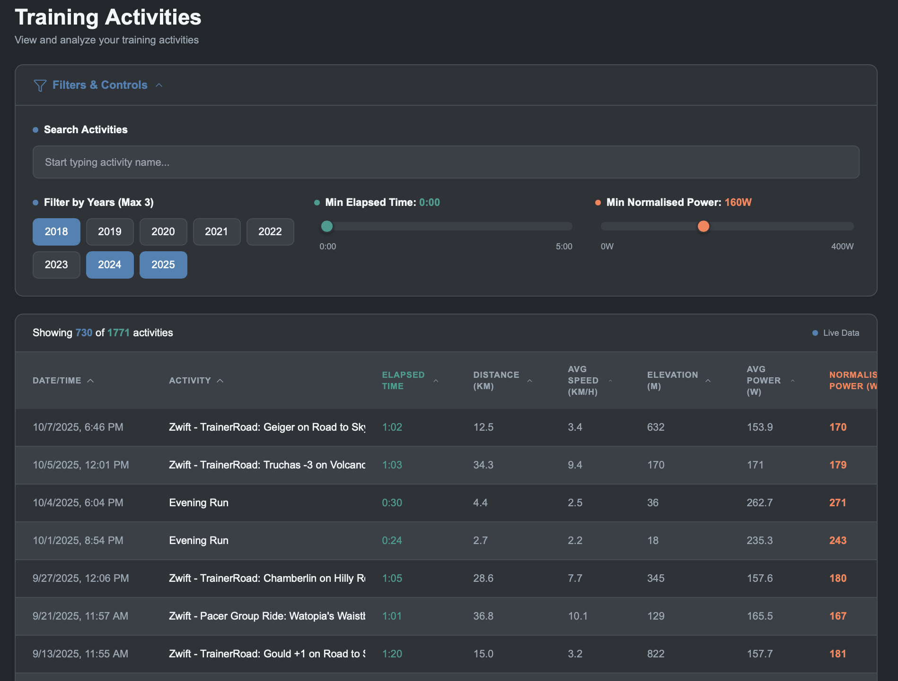
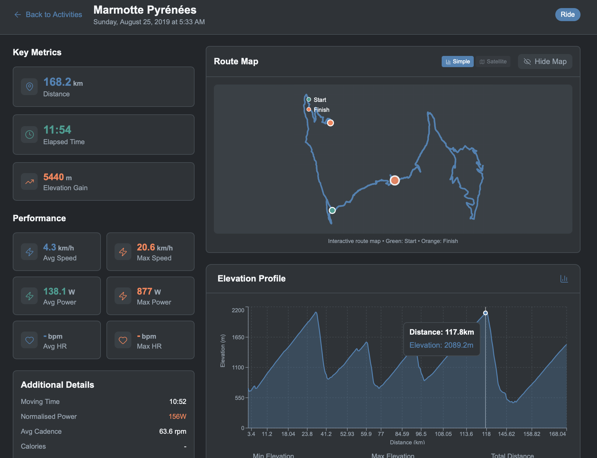
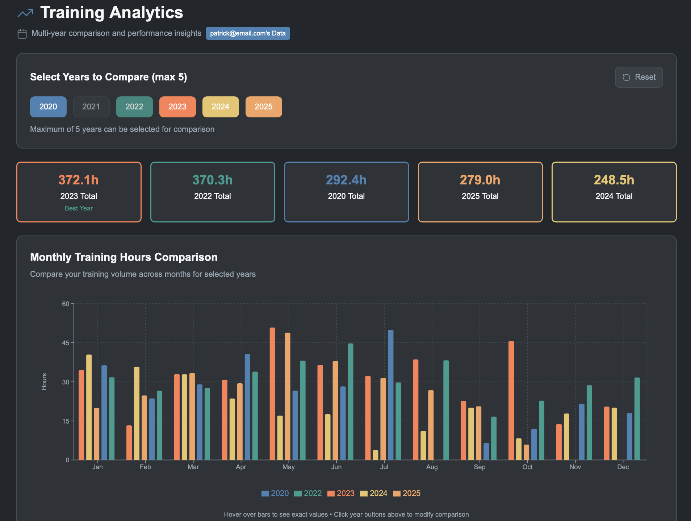

# Veloclicks 🚴‍♂️

Linked In : [https://www.linkedin.com/in/patrick-lowry-london]

**A full-stack cycling analytics platform with real-time Strava integration**

## Overview

Veloclicks is a cycling analytics platform that integrates with Strava to provide cyclists with a one-stop shop for activity data, visualizations and AI insights. It's built using modern full-stack technologies and containerized for easy deployment.

version: 2.0 7 Jan 2026

## Key Features

**Functionality**
- Strava integration for activity and data-stream loading
- Anthropic integration for AI-Insights (premium only)
- Full, tabularised activity inventory, filterable, sortable and searchable across key metrics
- Visualisation/comparison of activity stats across multiple years
- Route plotting (with or without background map)
- Elevation profile for each activity with heart rate, power, distance and altitude overlay
- Power curve and power zone distribution
- Suffer score estimation
- Secure registration and login
- Automated synchronisation of last 30days activities
- Bulk upload of previous years' activities
- Administration CLI

**Modern UI/UX**
- Dark theme with professional design system
- Responsive mobile-first design

## **Technology & Non-Functional Features**
### **Technical Architecture**
- **Microservices**: Containerized frontend, backend, and worker services
- **Database**: PostgreSQL with SQLAlchemy ORM and Alembic migrations
- **Asynchronous Messaging**: REDIS for Celery message broker integration to load strava activities in the background
- **API Design**: RESTful endpoints
- **Data Processing**: Optimized coordinate sampling and distance calculations to reduce performance impact

### **Strava Integration**
- **OAuth 2.0 Flow**: Complete Strava authorization workflow
- **Token Management**: Automatic refresh token handling

### **Security**

- **Authentication**: JWT-based stateless authentication
- **Authorization**: Route-level access control
- **Data Protection**: Password hashing with Werkzeug security
- **API Security**: CORS configuration and request validation
- **OAuth Security**: State parameter validation and CSRF protection

### **Performance Optimizations**

- **Database**: Indexed queries and connection pooling
- **Frontend**: Code splitting and lazy loading
- **API**: Data pagination and filtering
- **Caching**: Redis for session and task management
- **Coordinates**: Intelligent sampling for large datasets

### **Frontend Tech Stack**
- **Next.js 14** - React framework with app router
- **React 18** - Component-based UI library
- **Recharts** - Data visualization library
- **Tailwind CSS** - Utility-first CSS framework
- **TypeScript** - Type-safe JavaScript
- **Nginx** - Reverse proxy (production ready)

### **Backend Tech Stack**
- **Flask 3.0** - Python web framework
- **SQLAlchemy** - Database ORM
- **Alembic** - Database migration tool
- **JWT** - JSON Web Token authentication
- **Requests** - HTTP library for API integration

### **Database and Storage**
- **PostgreSQL 15** - Primary database
- **Redis** - Message broker and caching
- **Celery** - Distributed task queue
- **Docker Compose** - Multi-container orchestration

### **Containers and Deployment**
Multi-container setup via Docker Compose with:
- **Web**: Next.js frontend
- **API**: Flask backend
- **Worker**: Celery task processor
- **Database**: PostgreSQL with persistent volumes
- **Cache**: Redis message broker

## Active Development

### In Progress
- **Async Bulk Activity Import**: Moving multi-year activity loads to Celery background jobs to handle Strava API rate limits gracefully and improve UX for initial syncs
- Progress tracking UI for long-running imports
- Intelligent request throttling to stay within API limits

### Planned Features
- Activity comparison tools
- Export functionality
- Training plan
- Route and Activity visualisation

## Test Automation
Currently adding test coverage for:
- [ ] API endpoint tests
- [ ] OAuth flow tests  
- [ ] Database model tests
- [ ] Cypress automated tests

## Screenshots
Filterable, Sortable, Searchable Table of Activities

Activity Details with route and profile

Year on year comparison

## Author

Built as a hands-on project to explore modern full-stack development and fill a gap in Strava's capabilities (where it's very difficult to filter and sort activities across multiple years - plus their website is very difficult to navigate).

Tech background: Solution Architecture, Technical Delivery Leadership, MSc Data Science & ML (UCL 2024)

Based: London, United Kingdom

Linked In : [https://www.linkedin.com/in/patrick-lowry-london]

---

*This project showcases full-stack development capabilities including modern frontend frameworks, robust backend APIs, database management, third-party integrations, and containerized deployment strategies.*