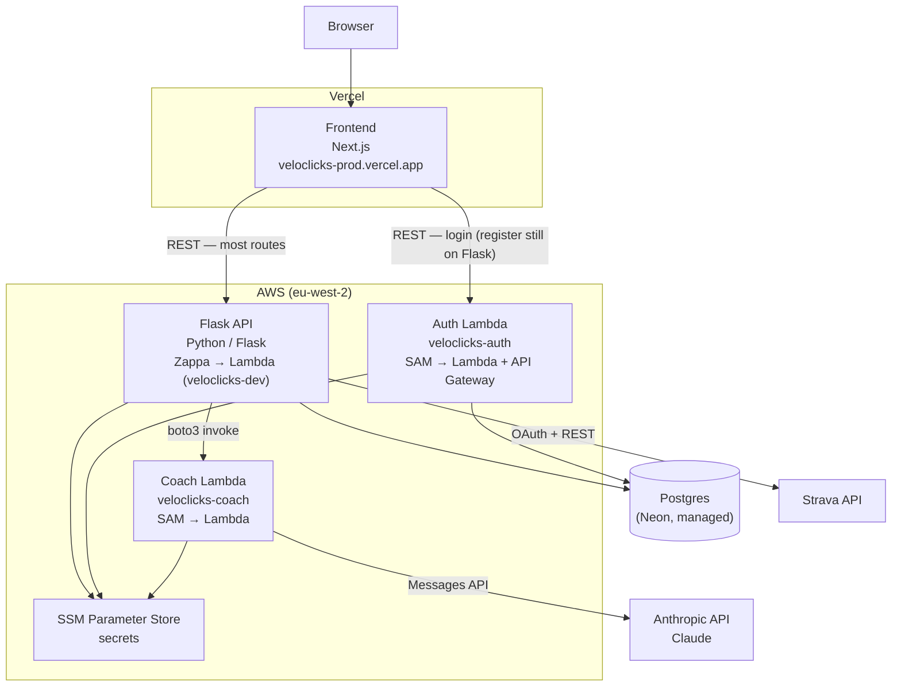
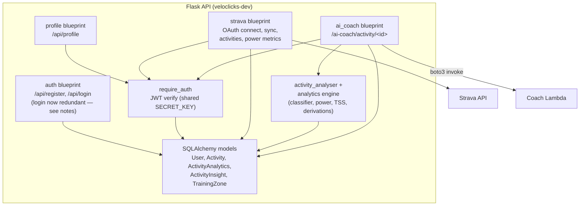
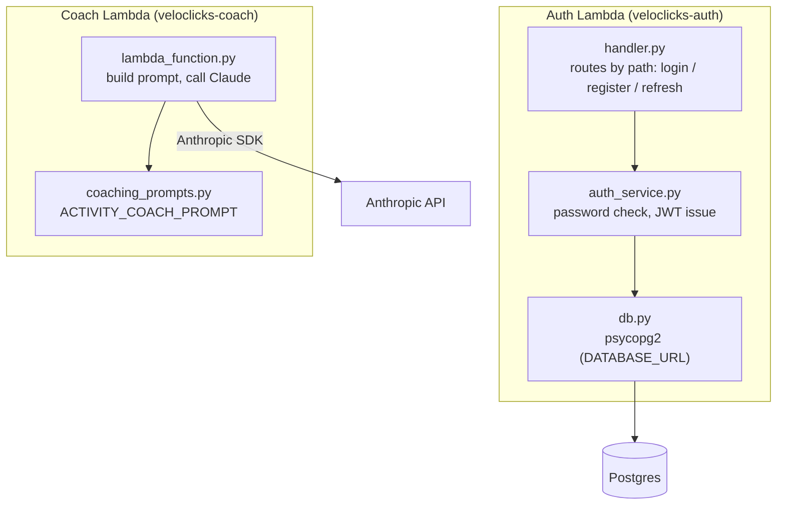
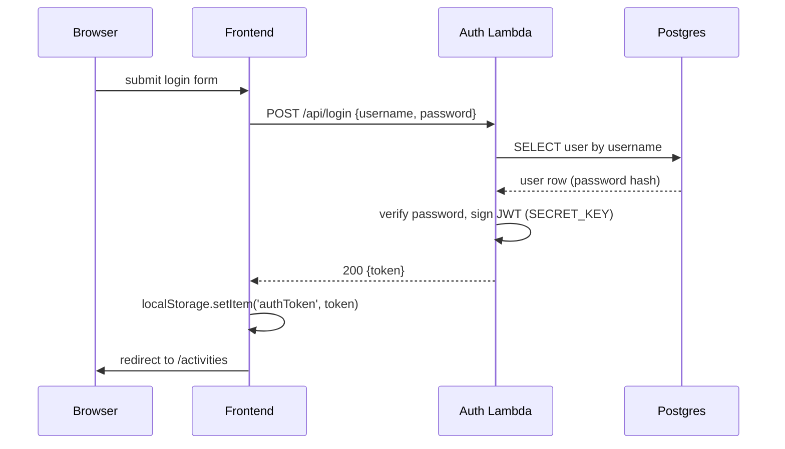
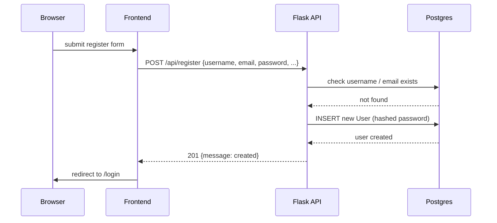
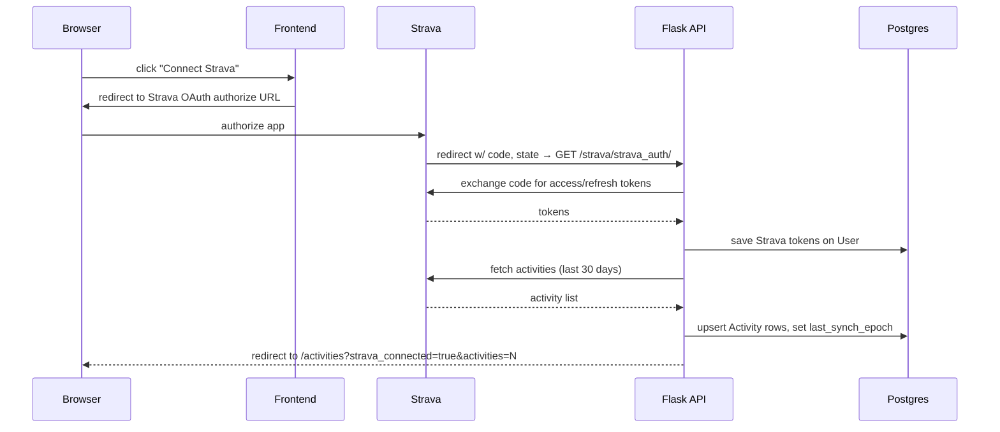
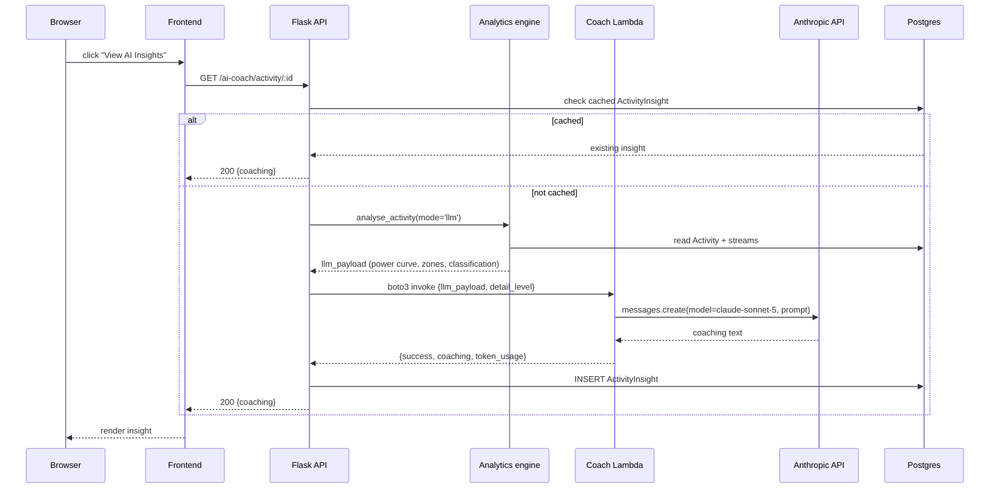

# Application Architecture

Snapshot as of 2026-08-28. Reflects what's actually deployed, not aspirational config —
see notes under each diagram for known gaps between the two.

## Container diagram (C4, level 2)

**Notes**
- Auth and Coach are deployed together under one CloudFormation stack (`veloclicks-lambdas`, from `lambdas/template.yaml`). Flask is deployed separately via Zappa, unrelated tooling.
- Only the frontend's **login** call was cut over to the Auth Lambda. **Register** still goes through Flask, even though the Auth Lambda also implements `/api/register` — see the Register sequence below.
- There is no "production" AWS environment — only `dev` exists (see [claude.md](../claude.md)). The Vercel frontend and Postgres DB are the only genuinely production-facing pieces today.

## Component diagram (C4, level 3)

### Flask API

### Auth Lambda & Coach Lambda

**Notes**
- `local_server.py` (Auth Lambda only, not shown) is a local-dev-only HTTP shim standing in for API Gateway when running under Docker Compose — see [lambdas/auth/local_server.py](../lambdas/auth/local_server.py). It has no effect on the deployed Lambda.
- Coach Lambda has no DB access — it's a pure prompt-in/text-out function; the analytics data is assembled entirely by Flask before invocation.

## Sequence: Login

## Sequence: Register

> Register still goes through Flask, not the Auth Lambda — only login was cut over so far, even though the Auth Lambda already implements `/api/register` too. Worth finishing the migration so there's one implementation, not two.

## Sequence: Activity Sync (Strava connect)

> A lighter incremental sync (`GET /strava/synch/`, using `last_synch_epoch` as the window start) exists for re-syncing after the initial connect, using the same `sync_activities` path.

## Sequence: Coach (AI Insights)

